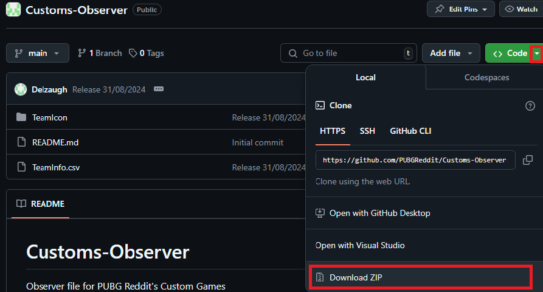
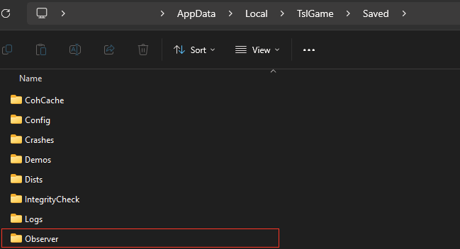
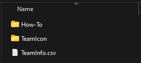

# PUBG Custom Team Logos Setup Guide

PUBG allows any player to add custom Team Logos to their games using what is called the `Observer File`.   
This will add the logo to the corresponding teams in the killfeed.  

If you are an Observer while spectating Esport/Custom games, you will also see the team names and tags.

# Observer Folder
The Observer folder is a folder containing the logos and configurations which the game understands and loads.  
For PUBG to load everything correctly, the observer folder MUST be placed in the correct location before starting the game.   
You can follow the How-To guide to learn on how to download and configure your own game to use PUBG Reddit's custom teams.

## How-To (Terminal & Git Clone)
 ### Step 1: Clone Repo
- Open Windows Explorer and paste the following location: `%localAppData%\TslGame\Saved`.  
This will bring you to the configuration folder of PUBG.
- Right click and select `Open Terminal`
- Use clone command: `git clone https://github.com/PUBGReddit/Customs-Observer Observer`

If you already have an Observer Folder present, you will first need to delete/rename it.
 
 ### Step 2: Start PUBG
- Start PUBG. The observer files are loaded when starting PUBG. If you added or changed the files while PUBG is open, you must restart PUBG.

### Step 3: Cleanup
- To remove the team logos, go back to the main folder: `%localAppData%\TslGame\Saved` and delete the `Observer` folder.

## How-To (Manual)

Follow this short guide to set up custom team logos in PUBG:

### Step 1: Download the needed files
 - Download all the necessary files from the provided source.  
 Select the dropdown next to the Code button, followed by Download ZIP   

### Step 2: Extract the Files
- Extract all the files on your computer.

### Step 3: Copy the Extracted Folder
- Open Windows Explorer and paste the following location: `%localAppData%\TslGame\Saved`.  
This will bring you to the configuration folder of PUBG.
- Move the extracted folder to this location.
- Rename the extracted folder to `Observer`.   

- Validate the content of the folder looks like   

### Step 4: Start PUBG
- Start PUBG. The observer files are loaded when starting PUBG. If you added or changed the files while PUBG is open, you must restart PUBG.

### Step 5: Cleanup
- To remove the team logos, go back to the main folder: `%localAppData%\TslGame\Saved` and delete the `Observer` folder.

### Enjoy your custom team logos in PUBG!

